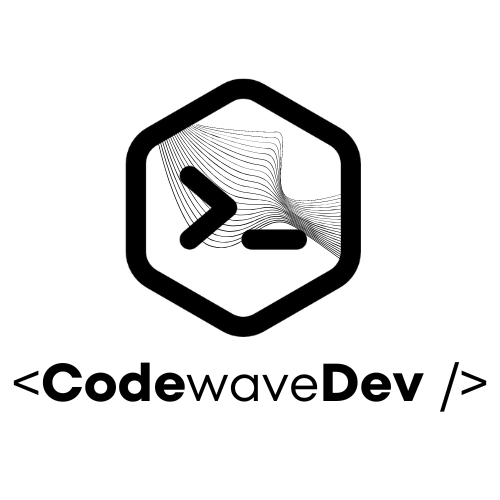

### Developer

Hi, I’m Leandro 👋
I’m Software Engineer | Senior Frontend Developer with a strong background in Backend development and Infrastructure architecture. Based in Italy, I enjoy building innovative products and solving real-world problems through code. My expertise includes frontend technologies like React, Next.js, and Vue.js, as well as backend development in Node.js, Laravel, and Spring. I also have extensive experience in infrastructure architecture with Kubernetes, Azure, and AWS.

📊 **this week i spent my time on:**
<!--START_SECTION:waka-->

```txt
Total Time: 5,100 hrs 7 mins

TypeScript                 2,863 hrs 9 mins█████████████▓░░░░░░░░░░░   55.23 %
PHP                        485 hrs 21 mins ██▒░░░░░░░░░░░░░░░░░░░░░░   09.36 %
JSON                       402 hrs 17 mins ██░░░░░░░░░░░░░░░░░░░░░░░   07.76 %
Vue.js                     331 hrs 7 mins  █▓░░░░░░░░░░░░░░░░░░░░░░░   06.39 %
JavaScript                 322 hrs 8 mins  █▓░░░░░░░░░░░░░░░░░░░░░░░   06.21 %
```

<!--END_SECTION:waka-->

<!--🚧 **My Todoist stats:**

 TODO-IST:START 
🏆  323 Karma Points           
🌸  Completed 0 tasks today           
✅  Completed 3 tasks so far           
⏳  Longest streak is 0 days
TODO-IST:END -->

### Gists Lists

<!-- [](https://gist.github.com/leandrovitto) -->

<!--  -->

[](https://gist.github.com/leandrovitto/71674a4428a74a12ff00bb0c91ad9155)
<!-- ](https://gist.github.com/leandrovitto/9e3216aa4ad753aa7af03133bddd21ec)-->


### CodeWaveDev

Enthusiast Trainer and Youtube Speaker (100h+ Contents, 3KSubs) on technologies related to the world of web development.
I created from scratch an e-learning platform to become a web developer codewave.dev

<a href="https://codewave.dev" target="_blank" rel="noopener noreferrer">
  
</a>

### Youtube

[](https://www.youtube.com/@codewavedev_)


### Let's Connect 🤝 

<a href="https://www.linkedin.com/in/leandrovitto/" style="margin-right:10px"></a>
<a href="https://www.youtube.com/@codewavedev_" style="margin-right:10px"></a><a href="https://leandrovitto.com/" style="margin-right:10px"></a>


